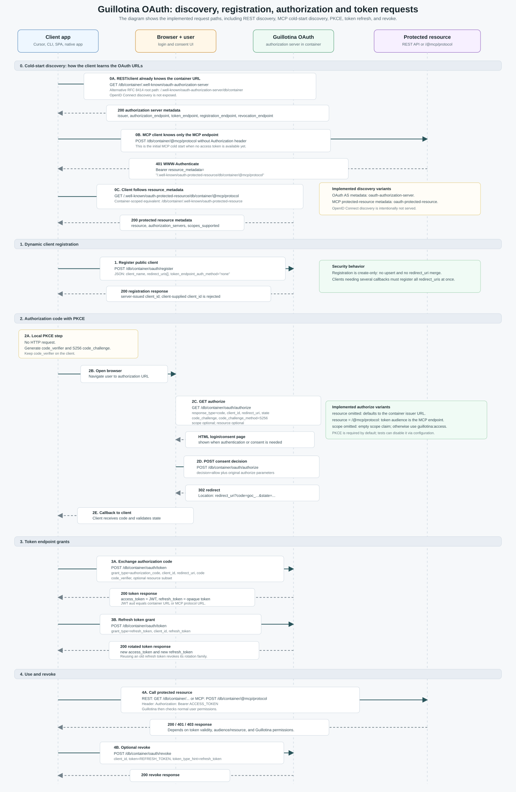

# OAuth authorization server

Install `guillotina.contrib.oauth` as an application and install the `oauth` addon in each container that should act as an authorization server. OAuth state is stored in PostgreSQL tables, configured via the `oauth_storage` utility settings.

## Configuration

To enable and configure the OAuth 2.1 authorization server, the following settings must be defined in your Guillotina configuration (e.g., `config.yaml`).

### 1. Enable the Application

Add `guillotina.contrib.oauth` to your list of active applications:

```yaml
applications:
  - guillotina.contrib.oauth
```

### 2. Configure JWT Secrets

Since OAuth Access Tokens are issued as signed JSON Web Tokens (JWT), you **must** configure the global JWT signing settings:

```yaml
jwt:
  secret: YOUR_SECURE_JWT_SECRET_KEY  # Change this to a secure key!
  algorithm: HS256
```

### 3. Configure Authentication Extractors and Validators

To support browser-based authentication (cookie-based login/consent session) and to validate incoming OAuth Access Tokens, you must configure the extractors and validators:

```yaml
auth_extractors:
  - guillotina.auth.extractors.BearerAuthPolicy
  - guillotina.auth.extractors.BasicAuthPolicy
  - guillotina.auth.extractors.WSTokenAuthPolicy
  - guillotina.auth.extractors.CookiePolicy       # Required for browser login & consent form

auth_token_validators:
  - guillotina.contrib.oauth.auth.validators.OAuthJWTValidator # Required to validate OAuth Access Tokens
  - guillotina.auth.validators.SaltedHashPasswordValidator
  - guillotina.auth.validators.JWTValidator
```

### 4. Set Write Permissions for GET Requests

Guillotina normally prevents database writes on GET requests. Since the `/oauth/authorize` endpoint (which is a GET request) needs to create/validate authorization states, you must override `check_writable_request`:

```yaml
check_writable_request: guillotina.contrib.oauth.api.request.check_writable_request
```

### 5. Customize OAuth Server Settings (Optional)

Protocol settings (issuer, token TTLs, PKCE, scopes) live under the `oauth` block. PostgreSQL cleanup tuning lives under `load_utilities.oauth_storage.settings`:

```yaml
oauth:
  enabled: true
  issuer: null                    # Custom token issuer URL (e.g. "https://auth.example.com")
  authorization_code_ttl: 600     # Time to live in seconds for Authorization Codes (default 10 min)
  access_token_ttl: 3600          # Time to live in seconds for Access Tokens (default 1 hour)
  refresh_token_ttl: 2592000      # Time to live in seconds for Refresh Tokens (default 30 days)
  require_pkce: true              # Whether PKCE is strictly required (always true for OAuth 2.1)
  scopes_supported:               # Optional OAuth protocol label (not used for authorization)
    - guillotina:access

load_utilities:
  oauth_storage:
    settings:
      cleanup_interval: 900       # seconds between expired-row cleanup runs
      cleanup_batch_size: 5000    # rows deleted per cleanup batch
```

The same cleanup keys may still be set under `oauth` for backward compatibility; utility settings take precedence.

OAuth state is always persisted in PostgreSQL tables (`oauth_clients`, `oauth_authorization_codes`, …). A PostgreSQL database storage is required.

## Discovery and OAuth vs OpenID (`openid-configuration`)

The primary metadata URL is `/.well-known/oauth-authorization-server` ([RFC 8414](https://www.rfc-editor.org/rfc/rfc8414)). The same JSON is also served at `/.well-known/openid-configuration` (container-scoped and RFC 8414 root variants) **as a compatibility alias** for clients that probe the OpenID path. This is still **OAuth authorization server metadata only**—not full OpenID Connect (no `id_token`, `userinfo`, OIDC JWKS, etc.).

## Allowed `resource` values (RFC 8707)

The `resource` parameter is restricted to URLs returned by registered resolvers in `guillotina.contrib.oauth.flow.resources`. The oauth application registers the **container issuer** by default (`https://host/db/container`). When both `guillotina.contrib.oauth` and `guillotina.contrib.mcp` are in `applications`, OAuth also loads the MCP integration, registers `{container}/@mcp/protocol`, and exposes MCP protected-resource metadata. That MCP resolver is ignored for OAuth-only deployments, so the MCP protocol URL is not accepted as a `resource` unless MCP is enabled.

From your addon `includeme` (or startup hook):

```python
from guillotina.contrib.oauth.flow.resources import register_oauth_resource_resolver

def my_resolver(request, container):
    from guillotina.contrib.oauth.api.urls import container_url
    base = container_url(request, container)
    return {f"{base}/@services/my-hook"}

register_oauth_resource_resolver(my_resolver)
```

## Dynamic client registration and redirect URIs

`/oauth/authorize` accepts only redirect URIs that are already present on the client record. `/oauth/register` always creates a new public client and returns a server-issued `client_id`; client-supplied `client_id` values are rejected. The registration endpoint does not update existing clients. Public clients that need multiple callbacks, such as Cursor native and loopback redirects, must include all allowed `redirect_uris` in the same dynamic client registration request. HTTPS redirect URIs are accepted for web clients. Plain HTTP is accepted only for loopback/native redirects (`localhost`, `127.0.0.1`, `::1`). Redirect URIs with fragments are rejected.

## Supported flow

The contrib implements public-client OAuth 2.1 Authorization Code with PKCE (`S256`), dynamic client registration, opaque refresh tokens, revocation, and JWT access tokens signed with Guillotina's configured JWT secret.



Endpoints are container scoped:

```text
GET  /db/container/.well-known/oauth-authorization-server
GET  /db/container/.well-known/openid-configuration
POST /db/container/oauth/register
GET  /db/container/oauth/authorize
```

RFC 8414 discovery for issuers with a path component (such as `/db/container`) is also exposed at the application root:

```text
GET /.well-known/oauth-authorization-server/db/container
GET /.well-known/openid-configuration/db/container
```

When using MCP, protected resource metadata follows [RFC 9728](https://www.rfc-editor.org/rfc/rfc9728):

```text
GET /db/container/.well-known/oauth-protected-resource
GET /.well-known/oauth-protected-resource/db/container/@mcp/protocol
```

Other container-scoped endpoints:

```text
POST /db/container/oauth/authorize
POST /db/container/oauth/token
POST /db/container/oauth/revoke
```

## How to Use PKCE and the OAuth Flow (Step-by-Step)

Follow these steps to generate PKCE credentials, register a client, authorize a user, and exchange the resulting authorization code for an Access Token.

### Step 1: Generate PKCE Secrets on the Client

Clients must generate a high-entropy random `code_verifier` between **43 and 128** characters from the unreserved set in RFC 7636 (`[A-Z] [a-z] [0-9] - . _ ~`), and compute its `code_challenge` using SHA-256 (BASE64URL encoding without padding).

#### **Bash / OpenSSL Example:**

If you are working on the terminal, you can quickly generate both secrets in your shell using `openssl`:

```bash
# 1. Generate a secure random code_verifier (URL-safe base64 encoded)
code_verifier=$(openssl rand -base64 32 | tr -d '=' | tr '/+' '_-')
echo "code_verifier: $code_verifier"

# 2. Compute the S256 code_challenge
code_challenge=$(echo -n "$code_verifier" | openssl dgst -binary -sha256 | openssl base64 | tr -d '=' | tr '/+' '_-')
echo "code_challenge: $code_challenge"
```

#### **Python Example:**

```python
import base64
import hashlib
import secrets

# 1. Generate the random code_verifier (keep this secret on the client!)
code_verifier = secrets.token_urlsafe(64)

# 2. Compute the code_challenge (SHA-256 hashed and encoded as URL-safe base64 with no padding)
hash_digest = hashlib.sha256(code_verifier.encode('ascii')).digest()
code_challenge = base64.urlsafe_b64encode(hash_digest).rstrip(b'=').decode('ascii')
```

#### **JavaScript Example:**

```javascript
// 1. Generate the random code_verifier (keep this secret!)
function generateCodeVerifier() {
  const array = new Uint32Array(56);
  window.crypto.getRandomValues(array);
  return Array.from(array, dec => dec.toString(16).padStart(2, "0")).join("");
}

// 2. Compute the S256 code_challenge
async function generateCodeChallenge(verifier) {
  const encoder = new TextEncoder();
  const data = encoder.encode(verifier);
  const hashed = await window.crypto.subtle.digest("SHA-256", data);
  
  return btoa(String.fromCharCode(...new Uint8Array(hashed)))
    .replace(/\+/g, "-")
    .replace(/\//g, "_")
    .replace(/=+$/, "");
}
```

### Step 2: Register a Public Client

Register your public client on the Guillotina container:

```bash
curl -X POST http://localhost:8080/db/container/oauth/register \
  -H 'Content-Type: application/json' \
  -d '{"client_name":"MCP Client","redirect_uris":["http://127.0.0.1:12345/callback"],"token_endpoint_auth_method":"none"}'
```

Save the resulting `client_id` returned by the server.

### Step 3: Direct the User to the Authorization Endpoint (Send Challenge)

Direct the user's browser to the authorize URL. **Here you must append the `code_challenge` and set `code_challenge_method=S256`** as query parameters.

For a **REST API client** (container-wide access), omit `resource` or set it to the container URL:

```text
http://localhost:8080/db/container/oauth/authorize?response_type=code&client_id=CLIENT_ID&redirect_uri=http://127.0.0.1:12345/callback&scope=guillotina:access&code_challenge=YOUR_CODE_CHALLENGE&code_challenge_method=S256&state=some_random_state
```

For an **MCP client**, include the MCP protocol endpoint as `resource`:

```text
http://localhost:8080/db/container/oauth/authorize?response_type=code&client_id=CLIENT_ID&redirect_uri=http://127.0.0.1:12345/callback&scope=guillotina:access&code_challenge=YOUR_CODE_CHALLENGE&code_challenge_method=S256&state=some_random_state&resource=http://localhost:8080/db/container/@mcp/protocol
```

The `scope` parameter is required and must include `guillotina:access`.

Once the user logs in and consents, they will be redirected back to your `redirect_uri` with an authorization code parameter:
`http://127.0.0.1:12345/callback?code=goc_XYZ123&state=some_random_state`

### Step 4: Exchange the Code for Access & Refresh Tokens (Send Verifier)

Now, send a POST request to the token endpoint to exchange the received code for actual tokens. **Here you must provide the original `code_verifier` (in plaintext) as a parameter** so the server can verify it against the challenge from Step 3:

```bash
curl -X POST http://localhost:8080/db/container/oauth/token \
  -H 'Content-Type: application/x-www-form-urlencoded' \
  -d 'grant_type=authorization_code&client_id=CLIENT_ID&redirect_uri=http://127.0.0.1:12345/callback&code=goc_XYZ123&code_verifier=YOUR_CODE_VERIFIER'
```

If successful, the response will contain your `access_token` and `refresh_token`.

### Step 5: Refresh and Revoke (Optional)

To obtain a new access token using your refresh token:

```bash
curl -X POST http://localhost:8080/db/container/oauth/token \
  -d 'grant_type=refresh_token&client_id=CLIENT_ID&refresh_token=YOUR_REFRESH_TOKEN'
```

Guillotina rotates refresh tokens on every successful refresh. The response contains a new `access_token` and a new `refresh_token`:

```json
{
  "access_token": "NEW_ACCESS_TOKEN",
  "token_type": "Bearer",
  "expires_in": 3600,
  "refresh_token": "NEW_REFRESH_TOKEN",
  "scope": "guillotina:access"
}
```

Clients must persist the new `refresh_token` and discard the old one immediately. The previous refresh token is revoked as soon as the rotation succeeds.

If an older refresh token is reused, Guillotina treats it as a replay signal and revokes the refresh-token family created from the same authorization code. OAuth clients should serialize refresh operations so two concurrent requests do not try to use the same refresh token at the same time.

To revoke an active refresh token:

```bash
curl -X POST http://localhost:8080/db/container/oauth/revoke \
  -d 'client_id=CLIENT_ID&token=YOUR_REFRESH_TOKEN&token_type_hint=refresh_token'
```

## Authorization model

OAuth provides **authentication** and **resource binding**. **Authorization** is always enforced with native Guillotina permissions on the authenticated user.

| Concern | Mechanism |
|---------|-----------|
| Who is the user? | OAuth token `sub` claim |
| Which client? | OAuth token `client_id` claim |
| Which resource? | Token audience (`aud`) — container URL or MCP endpoint |
| What can they do? | Guillotina roles and ACLs (`AddContent`, `ModifyContent`, `MCPExecute`, …) |

OAuth access tokens must include the `guillotina:access` scope. Authorization is still enforced with native Guillotina permissions on the authenticated user.

### REST API clients

Authorize without `resource` (defaults to the container). Use the access token as a Bearer token on any Guillotina API endpoint. The user's existing roles and ACLs apply.

```bash
curl http://localhost:8080/db/container/@addons \
  -H "Authorization: Bearer ACCESS_TOKEN"
```

### MCP clients (Cursor)

Authorize with `resource` set to the MCP protocol URL. MCP additionally verifies that the token audience includes that endpoint.

Example Cursor `mcp.json`:

```json
{
  "auth": {
    "CLIENT_ID": "...",
    "scopes": ["guillotina:access"]
  }
}
```

`@login` JWTs authenticate Guillotina sessions directly. OAuth access tokens include `token_type=oauth_access_token`, `client_id`, `scope` and audience/resource claims and are validated by the OAuth validator. MCP clients should use OAuth discovery and must not store manually copied bearer tokens in configuration.
